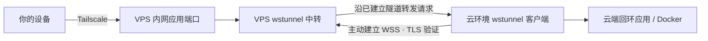

# Cloud Wstunnel Server

[English](README.en.md) · [部署 Skill](skills/cloud-wstunnel-server/SKILL.md) · [应用接入与恢复](skills/cloud-wstunnel-server/references/services.md)

通过 **ChatGPT Work/Codex 云环境 + 自有 VPS + wstunnel + Tailscale** 部署私人内网服务的 Agent Skill。云环境运行应用，主动连接 VPS；你的设备通过 Tailscale 访问 VPS 上分配给应用的内网端口。

已验证真实 Docker 应用的登录页面、跳转和资源访问。方案可用于重复部署新环境及增加服务映射；云平台的暂停、重建和进程生命周期仍需要恢复流程。



## 能做什么

- 新云环境接入已有 VPS 中转，无需重新配置整套私人网络。
- 为已有 Web/Docker 应用增加独立的 Tailscale 内网端口映射。
- 多环境分配独立鉴权条目，避免监听端口冲突。
- 诊断代理/VPN、TLS、监听、应用跳转和后台进程存续问题。
- 登记部署信息并在环境替换后恢复应用和隧道。

## 前提

1. 自有公网 VPS，能运行 wstunnel，具有有效 TLS 证书及可用 WSS 端口。
2. VPS 和访问设备加入 Tailscale；应用反向端口只绑定 VPS 的 Tailscale IPv4。
3. 云环境允许经其提供的 HTTP 代理访问该 WSS 入口，并支持实际 WebSocket 转发。
4. 云端应用本机可访问；Docker 使用平台支持的代理/CA配置。
5. Python 3.9+ 仅用于仓库中的可选健康检查工具和测试。运行应用并不强制使用 Python。

技能不会替你申请永久计算资源，不需要把 VPS root 密码交给云端，也不会取消平台代理或 TLS 验证。

## 安装

在 Codex 中请求：

> 使用 $skill-installer 安装 https://github.com/samsarawsf/cloud-wstunnel-server/tree/main/skills/cloud-wstunnel-server

也可手动克隆本仓库，将 **`skills/cloud-wstunnel-server` 整个目录**复制到 `${CODEX_HOME:-$HOME/.codex}/skills/`；其他兼容 Agent 使用其自己的技能目录。已有同名技能时先备份并检查差异，避免覆盖本地修改。

```sh
git clone https://github.com/samsarawsf/cloud-wstunnel-server.git
```

安装后，确保当前客户端已重新加载技能目录；新对话可按以下名称调用。

## 使用

```text
$cloud-wstunnel-server
在我的新云环境部署这个 Docker 服务，复用已有 VPS 中转，
通过 Tailscale 给我一个可访问的地址，并验证登录页面。
```

```text
$cloud-wstunnel-server
应用已在云端 127.0.0.1:8688 启动。
为它新增独立内网转发，保留其他服务和数据库。
```

需要提供或确认：目标云环境/对话、VPS 登录方式、VPS Tailscale 地址、有效 TLS 身份和应用目标端口。凭证通过授权的私有渠道提供，不提交到本仓库。

示例映射：VPS 的 Tailscale 地址 `:19088` → 云端 `127.0.0.1:8688`。用户打开的是 `http://VPS_TAILNET_IP:19088/`。VPS 公网 WSS 端口只负责接收隧道连接，**不是浏览器直接访问应用的入口**。

## 文档与工具

| 文件 | 用途 |
| --- | --- |
| [SKILL.md](skills/cloud-wstunnel-server/SKILL.md) | Agent 部署流程、权限边界和故障分流 |
| [deployment.md](skills/cloud-wstunnel-server/references/deployment.md) | 校验过的 wstunnel 基线、TLS、中转限制和连接模板 |
| [services.md](skills/cloud-wstunnel-server/references/services.md) | Docker 接入、多环境登记、数据与恢复 |
| [health_server.py](skills/cloud-wstunnel-server/scripts/health_server.py) | 可选回环健康服务，不读取文件或执行命令 |
| [probe.py](skills/cloud-wstunnel-server/scripts/probe.py) | 有界健康探测，检查角色与进程启动标识 |

健康脚本使用已有的 `work-cloud-private-server` 协议标识，便于兼容之前的部署记录；实际应用无需采用这个协议。健康检查不是每次部署应用的必经步骤。

## 运行边界

- 在本次已验证部署中，Docker 应用通过中转可正常访问；这不保证任意平台、镜像、目的地或长期在线 SLA。
- `nohup` 在某些云工具中会被清理；应使用平台支持的运行会话，并记录恢复方法。
- 新环境不默认继承旧数据库和进程。数据持久化、备份和恢复应单独确认。
- VPS 服务自启和 TLS 证书续期需在持续部署时配置并验证。
- 本仓库只提供技能、脚本和说明，不提供或捆绑 wstunnel/Tailscale 服务、账号或二进制。

## 开发与贡献

无需运行 VPS、Docker 或云环境，脚本测试仅使用本机回环临时服务：

```sh
python3 -m unittest discover -s tests -v
```

详见 [CONTRIBUTING.md](CONTRIBUTING.md)。安全问题处理见 [SECURITY.md](SECURITY.md)。本仓库采用 [MIT License](LICENSE)；第三方工具保持各自许可证与服务条款。
